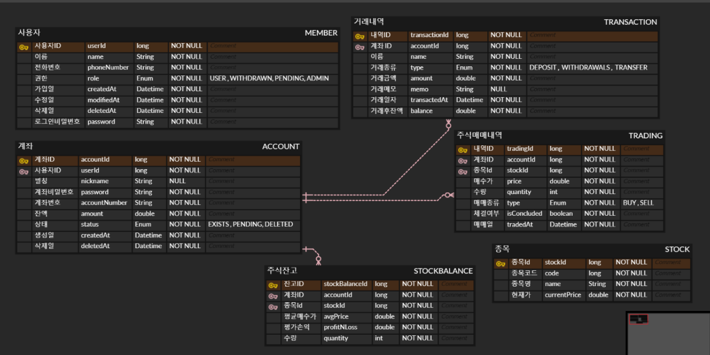

# 프로젝트 기능
주식 거래 및 친구와 보유주식내역 공유 가능

1. 회원가입 / 탈퇴
    - 전화번호 id, 인증 필요
    - 이름
    - 로그인 비밀번호
    - 회원가입 시, 자동 계좌가 개설 
     
2. 로그인 / 로그아웃
    - 전화번호(id), 로그인 비밀번호
    - 회원가입과 로그인을 제외한 모든 기능 로그인 필수
        
3. 계좌 거래 ( 충전 / 출금 / 송금 / 조회)
    - 계좌 비밀번호 인증 필수
        
    - 출금 / 송금
        - 현재 잔액 범위 내에서만 거래 가능
        - 주식을 매도한 금액은 매도일로부터 2 영업일 뒤부터 거래 가능.
            - D+1 (매도일): 2 영업일 뒤 출금 가능 금액으로 반영
            - D+2 (매도 다음날): 다음 날 출금 가능 금액으로 반영
                
    - 계좌 거래 내역 조회
        - 거래 일시, 거래 대상, 금액, 메모 포함
        - 특정 기간만 필터링 하여 조회 가능
            
    - 계좌 잔액 조회
        - 계좌 잔액, D+1 예수금, D+2 예수금 조회 가능
            
4. 친구 ( 신청 , 삭제, 친구 목록 조회) 
   요청시 본인과 상대방의 목록에 일괄 반영
     
    - 친구 신청
        - 공유한 링크 클릭
            
5. 주식 거래 (매수 / 매도 / 이체 / 조회)
    - 주식 가격은 크롤링
    - 주식 매매 시 금액, 종목 코드, 수량 입력 필수 & 계좌 비밀번호 인증
        
    - 매수
        - 계좌 잔액 내에서 주식 매수 가능
        - 보유주식 추가 구매 시,
           `((보유주식 단가 * 수량) + (추가 구매한 주식 단가*수량)) / 해당 종목 총 수량` 으로 계산하여 평균단가 계산.
            
    - 매도
      - 매도 즉시 잔액 출금 가능  **(*변경예정)**
      - 본인 보유 수량 초과 불가
          
    - 주식 잔고 이체 (주식 이체)
        - 타인에게 주식 이체 가능
        - 본인의 보유 수량 초과 불가
        - 계좌 예수금에서 `주식 가격 * 송금 수량 * 0.01` 수수료로 차감
        - 계좌 비밀번호 인증 필수
            
    - 조회 ( 현재 주식 잔고 / 주식 매매 내역 / 친구 주식 목록 조회)
        - 주식 잔고 조회
            - 종목코드, 종목 평균단가, 수량, 평가손익 조회가능
                
        - 매매 내역 조회
            - 종목코드, 매매일시, 매매가, 수량, 손익정보 포함
            - 기간 필터링 조회 가능
                
        - 친구 보유 주식 목록 조회
            - 종목명, 종목 현재 가격만 노출
                
6. 검색 (계좌 / 종목)
    - 계좌 검색
        - 계좌번호로 검색 -> 계좌 소유주명 조회 가능
            
    - 종목 검색
        - 종목코드 / 종목명 입력 -> 현재 가격 조회 가능
            
7. 공통
    - 비밀번호 오류 최대 5회, 이후 비밀번호 재설정 (핸드폰 인증 필요)
    - 비밀번호 인증에 성공 혹은 마지막 시도로부터 2시간 후 -> 오류 횟수 0회로 초기화

## 개선사항
- 주식 정보 저장방식 변경
    - 기존: 1일 1회 주식 종목 전체 정보 크롤링 (종목코드, 종목명, 종가 DB 저장- 실시간 반영 x )
    - 개선: 1일 1회 전체 종목코드 크롤링 (종목 코드, 종목명) + 종목 조회 요청시마다 해당 종목만 크롤링
        - 문제점 : 여러 종목을 조회할 경우, 서비스 시간 증가
- 속도 관련 내용 후첨 예정(*)

# ERD

		# API 명세
https://wiry-mimosa-01b.notion.site/API-5b1ccf98ee834a2689915d3833ca3e63?pvs=4

		# 사용 기술
- Java 11
- Spring
- Spring Security
- JWT
- Mysql
- Redis
- CoolSMS

# 추가/변경 예정
- 관심주를 저장 -> 실시간 시세 확인
- 알림기능 (매매시, 주식 목표 금액 도달, 친구신청 등)
- 보유종목 배당금 조회